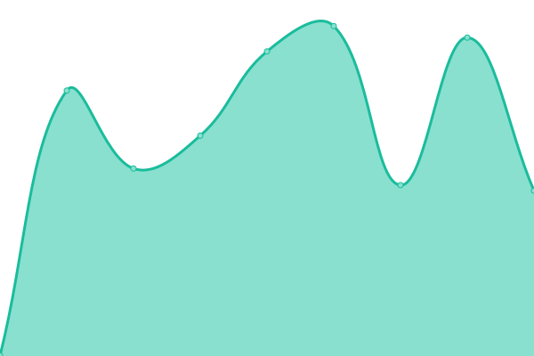
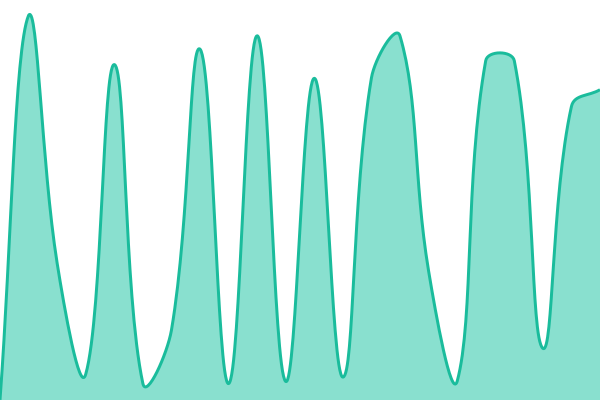

# [📈 Live Status](https://nunogand.com): <!--live status--> **🟧 Partial outage**

This repository contains the open-source uptime monitor and status page for [Nuno Rodrigues](nunogand.github.io), powered by [Upptime](https://github.com/upptime/upptime).

With [Upptime](https://upptime.js.org), you can get your own unlimited and free uptime monitor and status page, powered entirely by a GitHub repository. We use [Issues](https://github.com/nunogand/upptime/issues) as incident reports, [Actions](https://github.com/nunogand/upptime/actions) as uptime monitors, and [Pages](https://nunogand.com) for the status page.

<!--start: status pages-->
<!-- This summary is generated by Upptime (https://github.com/upptime/upptime) -->
<!-- Do not edit this manually, your changes will be overwritten -->
<!-- prettier-ignore -->
| URL | Status | History | Response Time | Uptime |
| --- | ------ | ------- | ------------- | ------ |
|  [nunogand](https://nunogand.com) | 🟩 Up | [nunogand.yml](https://github.com/nunogand/uptime/commits/HEAD/history/nunogand.yml) | 

 513ms
     
 | 

<a href="https://nunogand.github.io/uptime/history/nunogand">100.00%</a>
    

|  [USF Tempo de Cuidar](https://www.usftempodecuidar.pt) | 🟩 Up | [usf-tempo-de-cuidar.yml](https://github.com/nunogand/uptime/commits/HEAD/history/usf-tempo-de-cuidar.yml) | 

 1646ms
     
 | 

<a href="https://nunogand.github.io/uptime/history/usf-tempo-de-cuidar">79.68%</a>
    

|  [VPN](https://nunogand.asuscomm.com) | 🟥 Down | [vpn.yml](https://github.com/nunogand/uptime/commits/HEAD/history/vpn.yml) | 

 0ms
     
 | 

<a href="https://nunogand.github.io/uptime/history/vpn">0.00%</a>
    

<!--end: status pages-->

[**Visit our status website →**](https://nunogand.com)

## 📄 License

- Powered by: [Upptime](https://github.com/upptime/upptime)
- Code: [MIT](./LICENSE) © [Nuno Rodrigues](nunogand.github.io)
- Data in the `./history` directory: [Open Database License](https://opendatacommons.org/licenses/odbl/1-0/)
